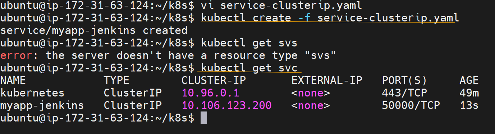

# Ativity 19

Pods and Services in Kubernetes Deployment

## Step 1: Install docker, minikube and kubectl

1. Launch an ec2 server with t2.medium
2. connect to mobaxterm using its public IP
3. Run the following comments to install minikube or follow this documentation [minikube installation](https://minikube.sigs.k8s.io/docs/start/?arch=%2Flinux%2Fx86-64%2Fstable%2Fbinary+download) and [Kubectl Installation](https://kubernetes.io/docs/tasks/tools/install-kubectl-linux/)

   ```bash
   # minikube installation
   curl -LO https://storage.googleapis.com/minikube/releases/latest/minikube-linux-amd64

   sudo install minikube-linux-amd64 /usr/local/bin/minikube && rm minikube-linux-amd64

   # Docker Installation
   sudo apt update
   sudo apt install docker.io

   # Adding ubuntu user in to docker group
   sudo usermod -aG docker $USER && newgrp docker

   # Start the minikube driver
   minikube start --driver=docker

   # Kubectl Installation
   curl -LO "https://dl.k8s.io/release/$(curl -L -s https://dl.k8s.io/release/stable.txt)/bin/linux/amd64/kubectl"

   sudo install -o root -g root -m 0755 kubectl /usr/local/bin/kubectl

   # Verify minikube version
   minikube status

   # Verify kubectl version
   kubectl version --client
   ```

## Step 2: Creating a Pod

1. Create a new file named with pod.yaml and add the follwoing data

   ```yaml
   apiVersion: v1
   kind: Pod
   metadata:
     name: myapp-nginx
   labels:
     app: myapp
   spec:
     containers:
       - name: nginx-container
         image: nginx
   ```

2. Run the apove file with the follwoing command

   ```bash
   kubectl create -f pod.yaml
   ```

3. Verify the pods using the following cmd.

   ```bash
   kubectl get pods
   ```

4. To delete the pod, use the following command

   ```bash
   kubectl delete pod myapp-redis
   ```

   **sample screenshot**

   

   

## Step 3: Creating a Replicaset

1. Create a new file named with rs.yaml and add the follwoing data

   ```yaml
   apiVersion: apps/v1
    kind: ReplicaSet
    metadata:
        name: myapp-nginx
        labels:
            app: myapp
    spec:
        replicas: 2
        selector:
            matchLabels:
                app: myapp
        template:
            metadata:
                name: myapp-nginx
                labels:
                    app: myapp
            spec:
                containers:
                    - name: nginx-container
                    image: nginx
   ```

2. Run the apove file with the follwoing command

   ```bash
   kubectl create -f rs.yaml
   ```

3. Verify the replicaset using the following cmd.

   ```bash
   kubectl get rs
   ```

4. Verify the pods using the following cmd.

   ```bash
   kubectl get pods
   ```

5. To delete the replicaset, use the following cmd.

   ```bash
   kubectl delete rs myapp-nginx
   ```

   **sample screenshot**

   

## Step 4: Creating a Deployment

1. Create a new file named with rs.yaml and add the follwoing data

   ```yaml
   apiVersion: apps/v1
    kind: Deployment
    metadata:
    name: myapp-nginx
    labels:
        app: myapp
    spec:
        replicas: 2
    selector:
        matchLabels:
        app: myapp
    template:
        metadata:
            name: myapp-nginx
            labels:
                app: myapp
        spec:
            containers:
                - name: nginx-container
                image: nginx
   ```

2. Run the apove file with the follwoing command

   ```bash
   kubectl create -f deployment.yaml
   ```

3. Verify the deployments using the following cmd.

   ```bash
   kubectl get deployments
   ```

4. Verify the replicaset using the following cmd.

   ```bash
   kubectl get rs
   ```

5. Verify the pods using the following cmd.

   ```bash
   kubectl get pods
   ```

6. To delete the replicaset, use the following cmd.

   ```bash
   kubectl delete deployment myapp-nginx
   ```

   **sample screenshot**

   

## Step 5: Creating a Service (ClusterIp)

1. To Demonstrate a service object, first we will create a deployment with jenkins.

2. Create a file named with service-deployment.yaml and add the follwoing data

   ```yaml
   apiVersion: apps/v1
   kind: Deployment
   metadata:
     name: myapp-jenkins
     labels:
       app: myapp
   spec:
     replicas: 1
   selector:
     matchLabels:
       app: myapp
   template:
     metadata:
       name: myapp-jenkins
       labels:
         app: myapp
     spec:
       containers:
         - name: jenkins
           image: jenkins/jenkins:lts
           ports:
             - name: http-port
               containerPort: 8080
             - name: jnlp-port
               containerPort: 50000
           volumeMounts:
             - name: jenkins-volume
               mountPath: /var/jenkins_vol
       volumes:
         - name: jenkins-volume
           emptyDir: {}
   ```

3. run the following cmd to create a deployment

   ```bash
   kubectl create -f service-deployment.yaml
   ```

4. Now, create a service for clusterIp.
5. create a new file named with service-clusterip.yaml and add the following data

   ```yaml
   apiVersion: v1
   kind: Service
   metadata:
       name: myapp-jenkins
   labels:
       app: myapp
   spec:
       type: ClusterIP
       ports:
           - port: 50000
           targetPort: 50000
       selector:
           app: myapp

   ```

6. To creat a service, run the following cmd.

   ```bash
   kubectl create -f service.clusterip.yaml
   ```

7. To see the service, run the following cmd.

   ```bash
   kubectl get svc
   ```

   **sample screenshot**

   

## Step 6: Creating a Service (NodePort)

1. create a new file named with service-nodeport.yaml and add the following data

   ```yaml
   apiVersion: v1
   kind: Service
   metadata:
     name: myapp-jenkins
   labels:
     app: jenkins
   spec:
     type: NodePort
     selector:
       app: jenkins
     ports:
       - port: 8080
         nodePort: 30000
         targetPort: 8080
   ```

2. To creat a service, run the following cmd.

   ```bash
   kubectl create -f service.nodeport.yaml
   ```

3. To see the service, run the following cmd.

   ```bash
   kubectl get svc
   ```

   **sample screenshot**
   

## Step 7: EKS Cluster Creation

1. Open EKS Dashboard in the aws console
2. Click on **Add Cluster** button
3. Enter EKS name, select IAM Role
4. Click on **Next** button
5. Select VPC and security groups
6. Click on next > next > next > create button
7. This will create a EKS cluster and it will take around 15-20 min

   **sample screenshot**

   

## STep 8: Creating nodes in EKS Cluster

1. Open EKS Cluster > Click on **Compute**
2. Add nodes in **Node Group** Section
3. Give the IAM role, Select AMI type as Amazon linux 2
4. Select t3.medium as an instance type
5. select min and max nodes in node group scaling
6. Go to last page and click on **Create Node** button
7. This will take 5-10 min to create node group

   **sample screenshot**

   

## Step 9: Allow traffing from security groups

1. Go to security group which is attached to eks cluster and allow traffic from port 30000

   

## Step 10: Validating the server

1. Go to EC2 instance which is associated to node in eks cluster
2. Copy the public IP and search in the browser
3. You will able to see the jenkins page in the screen

   
